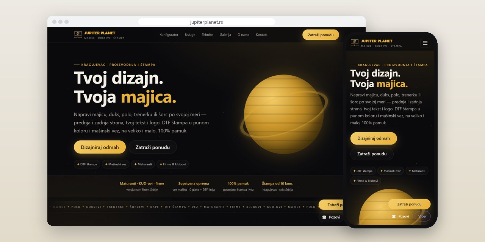
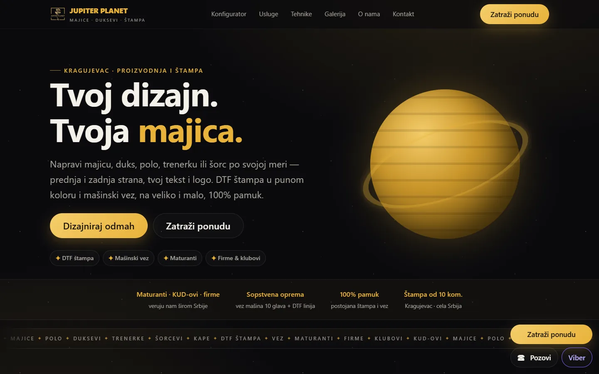
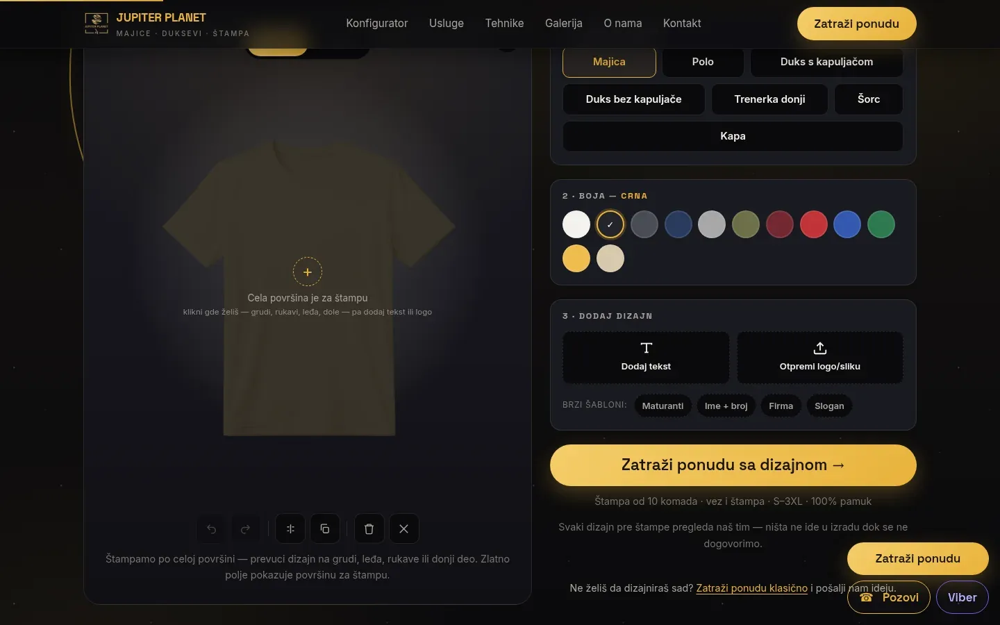
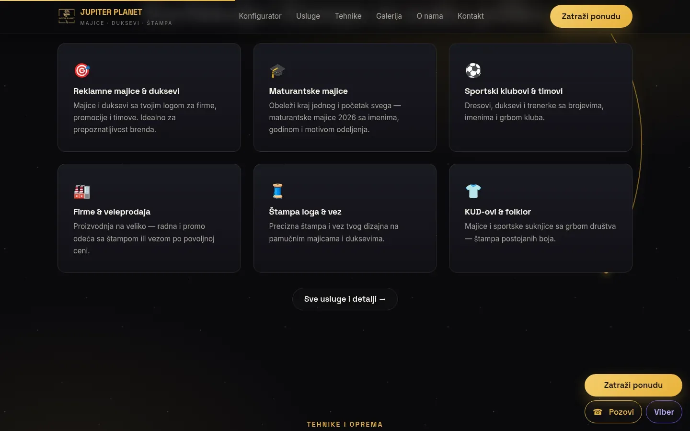

# Jupiter Planet

Site for a Kragujevac print and embroidery workshop, with a front-and-back T-shirt configurator that ends in a quote instead of a cart.

**[jupiterplanet.rs](https://jupiterplanet.rs/)** · [Case study (in Serbian)](https://svilenkovic.com/radovi/jupiter-planet) · [Srpski](README.sr.md)

> [!NOTE]
> Client project. The source code belongs to the client and stays in a private repository. This page describes what I built and how.

<table>
  <tr><td><b>Client</b></td><td>Jupiter Planet</td></tr>
  <tr><td><b>Industry</b></td><td>Printing and embroidery on T-shirts and other clothing</td></tr>
  <tr><td><b>Location</b></td><td>Kragujevac, Serbia</td></tr>
  <tr><td><b>Type</b></td><td>Multi-page website with a T-shirt configurator</td></tr>
  <tr><td><b>My role</b></td><td>Design, development, SEO, hosting and maintenance</td></tr>
  <tr><td><b>Stack</b></td><td>PHP 8.3, SQLite, Fabric.js 5.3, vanilla JS</td></tr>
</table>

## About the project

Jupiter Planet makes, prints and embroiders T-shirts, polo shirts, hoodies, tracksuits and caps in Kragujevac, from ten pieces per design. Before this site the whole business ran through Instagram messages, and a chat is a poor place to explain DTF print versus embroidery or to show how a logo sits on the back of a hoodie. Prices depend on quantity, material and technique, so a cart with fixed prices would have been wrong from the start.

The site is built around a configurator with seven garments, a colour palette and separate front and back layers for text and logos. Designs are clipped to the garment's own silhouette, so print can go anywhere, sleeves included. The colour comes from a multiply filter over a single white photo, which keeps folds and shadows visible in every shade. A new garment shows up as soon as its front and back images are in the folder, with no change to the code.

## What I built

- Quote requests with both sides of the design as images, sizes, quantities and a reference number, plus an instant email to the owner
- Touch controls: a delete handle on the object itself, a centring guide and a canvas that scales with the screen
- The garment mockup cut from 1.36 MB to about 85 KB as WebP, and the canvas library loaded only when the configurator nears the viewport
- Critical CSS inline plus a 2.6 second fallback timer, so a failed script can no longer leave a blank page
- An SMTP fix: a line holding a single dot no longer cuts a customer's message short
- The same configurator later moved to the owner's T-shirt shop, where it fills a cart instead of a quote

## Results

| | Performance | Accessibility | Best practices | SEO |
| :-- | :-: | :-: | :-: | :-: |
| Mobile | 99 | 100 | 100 | 100 |
| Desktop | 98 | 100 | 100 | 100 |

PageSpeed Insights, lab test of the live site, September 2026. Security headers: 6 of 6. HTML validator: no errors. axe accessibility check: no violations. Structured data: `ClothingStore`, `FAQPage`.

## Screenshots

<table>
  <tr>
    <td width="68%" valign="top"></td>
    <td width="32%" valign="top"></td>
  </tr>
</table>

The configurator: front and back, seven items, color and quick templates

Six job types: promo T-shirts, graduating classes, clubs, wholesale, printing and embroidery, folk ensembles

---

Built by [D. Svilenković](https://svilenkovic.com).
